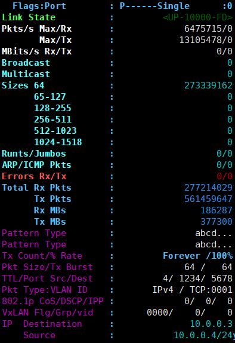
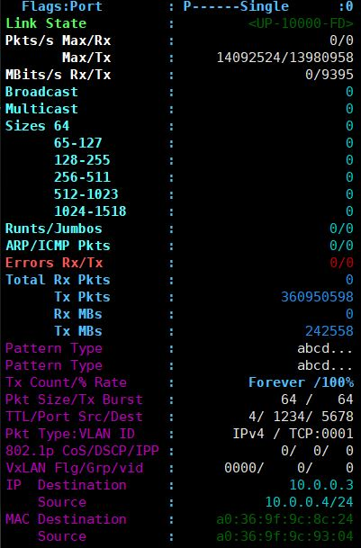
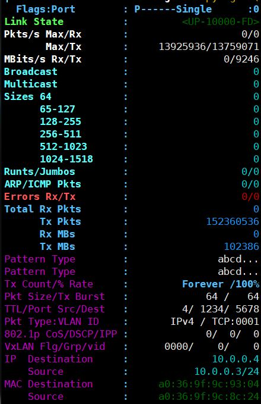
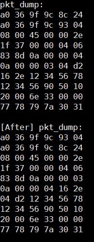

#DPDK

# 1. DPDK 개념
## 1.1 특징
* Intel Architecture 기반의 packet 처리 최적화 system software
* kernel 대신에 network packet을 처리하는 application을 제공하고 전용 CPU core을 할당해서 network card의 packet을 kernel을 거치지않고 직접 처리

## 1.2 장점
* packet 처리에 고성능을 보임
* 고가의 장비를 따로 구비할 필요가 없음 (KNI가 기존 장비로도 가능하게 해줌)
* CPU가 지장받지 않고 작업을 수행할 수 있음 (app에 전용 CPU core가 할당되므로)

## 1.3 단점
* Intel사의 system software다보니 사용가능한 lan card가 한정적임
* application이 network packet을 처리하다보니 application이 해야할 일이 많아짐
    * network packet 처리를 한다는 것은 packet header를 보고 packet 판별부터 동작까지 다 구현하는 것을 말함

## 1.4.kernel 기반 packet 처리 과정과 DPDK의 차이점
* batch packet 처리 기술을 통해 다수의 packet을 동시에 처리
* network packet마다 packet buffer memory를 dynamic하게 alloc/dealloc하던 것을 static하게 할당
* Lockless Queue를 구현하여 shared data 접근시의 bottle neck을 해결
* huge page를 이용하여 TLB miss를 줄임
* optimized poll mode driver를 통해 physical NIC과 virtual NIC driver을 최적화시킴
* pre-fetching과 cache line사이즈로 정렬하여 CPU가 data를 기다리는 것을 최소화시킴
* CPU core isolation을 사용하여 thread switching overhead를 해결
* KNI를 사용하여 host kernel networking stack의 성능을 개선

## 1.5 Lockless Queue
* 원래는 여러개의 thread가 동시에 push를 하거나 pop을 하는게 불가능한 것으로 알았음
* 기존 lockless queue의 경우 lock queue를 여러개를 두기때문에 동시에 하는 것이 불가능
* dpdk의 경우 single lock queue를 사용하여 이를 가능하게 함
* CAS(compare and swap)연산을 사용 (exchange로 기록된것은 의미상 비슷해서 표현을 다르게 한 것 같음)
* queue에 enqueue와 dequeue를 하는 게 또다른 queueing을 하는 듯한 느낌을 줌
* dpdk 홈페이지에는 core라고 표현을 하지만 thread와 비슷한 의미로 사용한 것 같음
    * 추가 확인 필요

### 1.5.1 Lockless Queue 실행 과정
* state를 담을 structure를 구성(cons_head/tail, prod_head/tail을 담고 있음)
* structure에서 각 core의 local variable에 prod_head와 cons_tail을 복사해서 넣어줌
* 각 core의 local variable에 prod_next(cons_next)를 만들어서 다음칸을 가리키게함
* local variable의 prod_head에 data를 저장하고, prod_next를 한칸 움직임
* local variable의 prod_next와 structure의 prod_head가 같도록 prod_head를 한칸 움직임
* 이때 하나의 core가 data를 저장하면서 sturcture의 prod_head가 움직인 상태기 때문에
다른 core의 prod_next와 structure의 prod_head가 다른 칸을 가리킴
* 이걸 compare함 
    * structure의 prod_head와 현재 core의 prod_next를 비교해서 같으면 data 저장을 진행
    * structure의 prod_head와 현재 core의 prod_next가 다르면 한칸 앞으로 움직임
    * 위를 반복해서 같아지게 만들어줌
    * redo part란 비교 후 prod_next를 움직이는 단계로 돌아가는 것을 말함
* data 저장이 끝나면 prod_tail을 앞으로 한칸 움직이고 끝냄
* 위는 enqueue의 경우만 나타냈는데 dequeue의 경우 cons_head와 cons_next로 똑같은 과정을 진행
* swap은 어디에...?
    * prod_head를 왔다갔다 하는 부분을 swap이라고 하는건가? -> swap이 아닌 거 같은데 -> 확인 필요

### 1.5.2 Lockless Queue 추가 내용
* 결국 lock이 발생할 수도 있음
    * redo part를 계속 돌리면 prod_next를 계속 돌리는 걸 반복하는 spin lock이 발생함
    * 이를 보고 CAS가 실패했다고 표현함
* homepage에 여러개의 lockless queue를 쓰는 경우보다 빠르고 간단하며 여러개의 dequeue/enqueue를 적용하기에 좋다고 표현함
    * 그럼 기존 spinlock이나 mutex, semaphore과의 성능차이는? -> 확인 필요
    * 여러개의 lockless queue는 bulk enqueue/dequeue를 아예 못하는건가? -> 확인 필요

## 1.6 optimized poll mode driver
* interrupt 기반 packet 처리는 interrupt가 발생할때마다 interrupt를 걸게 되므로 비효율적
* 이를 보완하기 위해서 polling을 사용 + 최적화
* run-to-completion(asynchronized)
    * PMD를 실행하는 CPU core가 network packet까지 한번에 처리
    * 특정 port의 rx descriptor ring이 이 PMD를 실행한다는 뜻
    * packet을 한번에 하나씩 처리
* pipeline(synchronized)
    * PMD를 실행하는 CPU core가 있고 실제 packet의 처리는 다른 CPU core에서
    * 하나의 core가 하나 이상의 port의 rx descriptor ring을 polling (PMD core)
    * ring 따라서 다른 core로 이동 후 그 core에서 packet처리 (pakcet 처리 core)
* lock contention을 막으려면 pipeline을 많이 써야함
* 사용자가 DPDK를 사용할때 PMD를 잘 골라서 최적화를 시켜야한다는 건가?

## 1.7 CPU core isolation
* linux scheduler의 thread switching overhead 문제를 해결해준 solution
* software thread를 hardware thread로 mapping하는 기법
* core affinity와 관련있어보임
    * cpu affinity는 cpu 간에 task 이동을 막는 정도를 말함
    * isolation이니 이동을 막겠다는 의미
    * 이거랑 software thread를 hardware thread로 mapping하는게 어떤 연관성이 있지?
        * mapping한다는 게 hardware thread에 software thread가 적절하게 배분한다는 뜻인듯
* software thread를 hardware thread로 mapping해서 affinity를 강하게 줘서 isolation을 만듬
* 이를 통해 thread switching이 줄어들어 overhead가 적어짐

## 1.8 Kernel NIC Interface(KNI) 
* user space에서 application이 kernel networking stack과 packet을 교환하게 해줌
    * kernel이 packet을 처리하지 않으니 stack에서 꺼내와서 packet을 만질 수 있게 해줌
* kernel에서 ethernet을 통해서 packet이 나와서 각 core로 넘어감
* 그 후 core에서 처리된 packet들이 지정된 port로 나감
* port를 통해 들어온 packet들은 core에서 처리되고 ethernet을 통해 kernel로 감
* 이러한 과정들을 진행하게 해주는 interface를 KNI라고 함 

## 1.9 종합
* DPDK는 KNI라는 interface를 구성해서 kernel에서 packet을 받아와서 core에 할당, 처리를 가능하게 해줌
* kernel을 거치지 않고 packet을 처리할 수 있게 해줌
* kernel을 거치지 않기 때문에 packet을 처리하는 기능을 구현해야하고 이와 관련된 최적화를 제공해줌
* interrupt 기반이었던 packet 처리방식을 polling을 통해 진행
* core간의 synch문제를 최적화된 lockless queue를 사용해여 해결
* CPU core isolation을 통해 thread switch overhead를 줄여줌
* 메모리 관리부터 core간의 synch, overhead, batch packet 처리 등 packet 처리에 최적화된 "환경"을 제공해줌 

## 1.10 기타

### 1.10.1 I2P
* application이 익명으로 안전하게 서로에게 message를 보낼 수 있게 해줌
* 암호화를 통해서 서로에 대한 정보를 감춘 상태에서 보내는 방식
* 누구에게서 나와서 어떠한 정보를 담고 있으며 어디로 가는지가 모두 암호화 돼있음
 * dpdk에서 이걸 쓰는 이유는?

---

# 2.DPDK를 사용한 ICMP 처리 application 구현

## 2.1 dpdk EAL option
* -c <core mask>
    * 16진법 수인 <core mask>부분을 2진법으로 나타냈을때 1인부분의 core를 실행시킴
        * e.g.(1a = 0001 1010 -> core 1, 3, 4 실행)
* -n <memory channel>
    * memory channel의 수를 정함
    * memory channel이란 memory와 CPU의 cache 간의 data 통로
    * dmidecode -t 17 | grep -c 'Size:'로 memory bank의 수를 알 수 있음
    * 이것이 bandwidth에 영향을 줌
    * channel이면 data가 왔다갔다 할 수 있어야 하므로 memory bank 2개가 1개의 channel을 이룸

## 2.2 dpdk의 기본 handling
* I2p_create()
    * network 암호화를 위해서 I2p를 만들어줘야함
* rte_eal_init
    * EAL을 intialize해줘야 library와 application에서 abstraction이 가능함
* rte_eth_dev_count_total()
    * ethernet을 사용할 device의 수를 count해야함(i.e. port 수 count)
* rte_eth_dev_configure
    * port 설정해줘야함
* rte_lcore_to_socket_id
    * 해당 id의 lcore에 연결된 physical socket의 id를 찾아와야함
* rte_pktmbuf_pool_create
    * packet buffer를 만들 memory pool을 만들어야함
* rte_eth_rx_queue_setup
    * rx_queue를 setting해줘야함
* rte_eth_tx_queue_setup
    * tx_queue도 setting해줘야함
        * 현재 dpdk.c에는 tx는 없는듯
* rte_eth_macaddr_get
    * 사용할 ethernet의 MAC address를 받아옴
* rte_eal_remote_launch
    * 현재 lcore의 slave core에도 하고자 하는 기능을 실행시킴
        * slave core는 어떤거지?
* rte_eth_dev_start
    * 설정을 다 마친 device(port)를 실행시킴
* rte_eth_dev_stop
    * device(port)를 멈춤
* rte_eth_dev_close
    * device(port)를 끝냄
* rte_eal_wait_lcore
    * EAL에게 멈추라고 신호를 보냄
        * i.e. EAL에 묶여있는 모든 core에게 대기신호를 보냄
* rte_eth_rx_burst
    * rx descriptor에 넣을 rte_mbuf NIC에서 받은 정보로 초기화시킴
    * 초기화 시킨 rte_mbuf를 rx_pkts array에 넣어줌
    * 새로 쓸 rte_mbuf를 intialize time에 만들어줌
    * NIC에서 packet정보를 받아서 buffer에 담아서 rx_packet 형태로 만들어줌
* rte_eth_tx_burst
    * transmit ring에서 사용할 수 있는 descriptor를 가져옴
    * 그 descriptor를 비움
    * 보내야할 rte_mbuf에서 info를 가져와서 descriptor를 초기화시킴
    * 보낼 packet을 descriptor에 담아서 tx_packet을 만듬

## 2.3 현재 진행상황

* 01/29 현재 진행상황

dpdk-option

* 위와같이 option을 주니 해결됨
  * 그런데 왜 0-6까지의 core는 master core가 안되고 7만 되는거지?

10.0.0.4 -> 10.0.0.3 with dpdk.c

* TX에 비해 RX가 반정도 나옴
* 이 전에 test했을때 TX가 14정도 였는데 다시 1정도 줄어듬

10.0.0.4 -> 10.0.0.3 with pktgen

* packet generator로 했을때는 다시 TX가 14정도 나오는 걸 확인할 수 있음

10.0.0.3 -> 10.0.0.4 with pktgen 
	

* 0.3에서 0.4 방향으로 가는게 1정도 더 느림

header swap in dpdk.c

* dpdk.c에서 header swap은 정상적으로 일어나는 것을 확인할 수 있음
  * 위 2줄을 비교해보면 after에서 2줄이 서로 바뀌어있음을 확인할 수 있다
  * mac 주소가 바뀐 것

* ps) RTE_SDK를 환경변수로 지정을 해주고 bash.bashrc에도 저장을 했는데도 makefile이 인식을 못한다.
* 그래서 필요한 file마다 찾아가서 저장을 해줬다.
* source써서 실행하고 reboot까지 했지만 설정이 안됨
* 원인은 알 수 없다....

