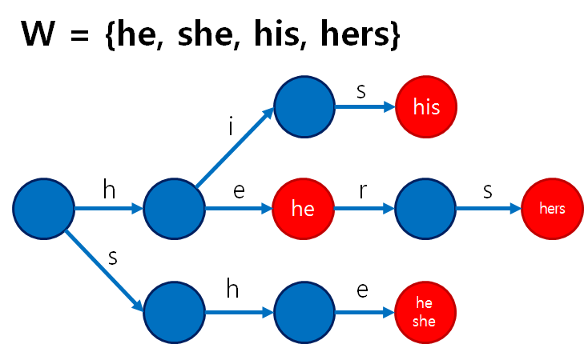
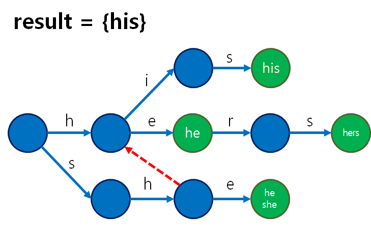
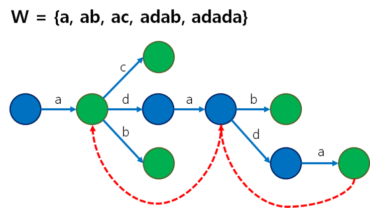

# Summary of Aho-Corasick Algorithm

## Concept of Aho-Corasick Algorithm

* Aho-Corasick에 대한 이해를 도와준 블로그 링크이다

[Aho-Corasick Algorithm](https://m.blog.naver.com/kks227/220992598966)

* Aho-Corasick 알고리즘은 다음의 과정을 통해 진행된다

**1. 주어진 data들을 Trie에 담는다**

​	
​	
* 위 링크의 블로그에서 보여준 사진이다

* W라는 data set에 있는 he, she, his, hers를 Trie에 담아서 표현해준다

* 이때 he, she, his, hers가 완성되는 지점은 빨갛게 표시되어있는데 저 부분들이 Output Link가 된다

**2. Failure Link를 이어준다**

* 위의 사진은 S=shis라는 string을 test해보기 위해서 Failure Link를 추가한 그림이다
* sh까지 test했을때 가장 밑의 줄의 s->h의 과정을 거치다가 다음 글자인 i로 가기위해 두번째 줄의 h의 값을 가진 node로 이동한다
* 이러한 방식으로 하나씩 Failure Link를 추가해준다
* KMP알고리즘에서의 Failure 함수와 동일한 알고리즘의 방식으로 추가해주는 것이다
* 이 과정은 data를 Trie에 추가해주는 과정에 같이 진행된다
* 즉, **input data가 아닌 기존에 가지고 있던 data**를 사용해서 추가해주는 것이다
* 위의 예시에선 S=shis라는 input data를 이용해 Failure Link를 보였지만 실제로는 그렇지 않다

**3. Output Link를 지정해준다**

* 실제로 Link를 지정해준다기보단 Output node를 지정해주는 것이다
* **이 node를 마지막 node로 가지는 string data가 있다**라는 의미이다
* Failure Link를 통해 이동할 수 있는 지점까지 모두 포함해준다

**4. Input data를 matching한다**

* 모든 Link를 이어주었다면 Input data를 matching해본다
* Failure Link를 타고 이어가다가 Output Link를 만나면 가장 최근에 matching되었던 문자부터 Output Link까지의 문자를 matching된 문자열로 인식한다

* 위의 사진은 이 전에 있던 예시와 다른 예시이다
* S = adadac를 input data로 받아 matching해본다고 가정하자
* 두번째 줄의 node를 타고 a -> d -> a -> d -> a까지 매칭한다
* 그 다음 a -> c를 매칭하기 위해서 2번째 줄의 3번째 a(파란색 노드)로 Failure Link를 타고 이동한다
* c를 값으로 가지는 child node가 없기 때문에 다시 Failure Link를 타고 두번째 줄의 첫번째 a(초록색 노드)로 Failure Link를 타고 이동한다
* a -> c로 이동할 수 있는 link가 있으므로 a -> c를 매칭시키고 끝낸다

---

## Application to NIDS

* NIDS에 사용될때 Aho-Corasick 알고리즘의 변화는 없다
* 알고리즘에 대한 내용은 제외하고 적용될때 추가된 부분만 기록한다

1. Trie를 만드는 data set이 rule set이다
   * nids의 특성상 당연하다
   * rule set을 Trie로 만들기 위해 rule set을 parsing하는 과정이 필요하다

2. GPU에서는 Trie를 2차원 배열의 형태로 사용한다
   * Linked List를 변형한 형태인 Trie를 직접 GPU상에서 구현하여 작동할 경우 overhead가 극심해진다
   * 이 때문에 Alphabet 표를 2차원 배열로 만들어 사용한다
   * 각 행은 depth를 의미하고, 각 열은 Alphabet을 의미한다.
     * e.g. 2행 = depth가 2인 node, 
     * 10열 = ASCII code를 10으로가지는 char값
       * 그래서 사실상 Alphabet이라고 칭할 수는 없음
   * 실제로는 portGroup별로 Trie를 가져아하므로 3차원 배열변수로 다루지만 Trie만을 보았을때는 2차원 배열이다
3. 각 state를 지정해주어야한다
   * -1 : 값이 없는, 존재하지 않는 node를 의미
   * 0  : root node를 의미
   * n : 다음 node가 n번째 node라는 의미
     * 다음 node가 n을 depth로 가지는 node라는 의미
     * 다음 state가 n을 depth로 가지는 node라는 의미
     * 다음 state의 위치
     * 모두 동일한 말이다
4. GPU에서는 Failure Link와 Output Link 모두 2차원 배열의 형태로 사용한다
   * Trie의 경우와 동일한 이유를 가짐
5. 여러개의 thread가 packet을 나눠서 관리하기때문에 rule matching 관리에 주의해야한다
   * thread가 payload를 나눠서 병렬적으로 관리하다보니, 분할된 구역에 걸쳐있는 rule들의 검색에 주의해야한다
     * 이와 관련된 부분은 section을 나눠서 아래에 서술함
   * thread를 어떻게 몇 개나 할당해줄것인가에 대한 실험도 필요하다
     * ipsec 구현에 사용된 thread 수를 이용

---

## Code Analysis

#### initialize\_nids

* initialize\_nids 함수는 이름과 동일하게 nids를 위한 초기화과정이 담긴다
* 초기화에는 rule set을 가져와 이를 Trie에 담는 것도 포함된다
* Trie에 담는 과정은 다음과 같다
  1. rule set 파일을 읽어와 이를 parsing하여 data를 뽑아내다
     * data에는 dst인지 src인지, port번호는 몇번인지, state는 어떠한지에 대해 담겨있다
     * dst / src와 port에 대한 정보를 알려주고, state의 수(depth)를 알려준다
     * (현재 state) : (이전 state) data(int) data(char)의 형태로 state의 정보가 저장되어있다
  2. Failure Link를 이어준다
     * 해당 port의 Failure Link의 정보를 담는 배열을 -1로 초기화한다
     * 0번째 열의 값들(root node)의 Failure Link를 0으로 지정해 root의 Failure Link가 root로 이어지게 한다
     * root의 child node를 queue에 저장해두고, queue를 pop 시키면서 child node들의 Failure Link를 모두 이어준다
     * Failure Link를 이어준다는 것은 해당 지점에서 Failure이 일어났을때 어디로 이어질 것인가, 즉, 같은 값을 가지는 node이면서 child node를 가지는 값을 찾아서 이어준다는 것이다
  3. Output node를 지정해준다
     * 사실 이 과정은 2번의 Failure Link를 이어주면서 같이 진행된다
     * 해당 지점을 거친 pattern이 어디에 있는 node에서 끝나는지를 저장해주는 것이다
     * 아직 완벽하게 이해가 되지 않은부분이다
  4. Trie에 값들을 대입해준다
* 위의 과정을 rule set에 있는 모든 port에 대해 마치면 이들을 cudaMemcpy로 gpu에 넘겨준다
  * 위의 Trie와 Failure Link, Output을 담는 array는 2차원 배열인데, 이를 cudaMemcpy2D나 cudaMallocPitch로 넘겨주지 않는다
  * cudaMallocPitch의 형태를 본따서 넘겨준다
  * gpu에allocation된 memory를 접근할 pointer를 담을 배열을 만들어 각각의 pointer에 cudaMalloc을 해준다
  * 결국 device pointer 배열을 만들어 이를 이용해 처리하는 방식이다
* gpu에 위의 데이터들을 다 넘겨주고 나면 nids Kernel을 호출한다

#### nids

* rule set에서 뽑아온 data들은 모두 대문자이므로, 대문자로의 변환을 위해 사용할 xlatcase 배열을 만든다
* lookup2D함수를 통해 받아온 packet의 port에 해당하는 Trie에서 rule과 matching되는 pattern이 있는지 Failure Link를 이어가며 찾아본다
* 찾은 후 output 배열에서 값을 찾아와 매칭이 된건지 판단하여 이를 ret에 저장한다
* 위의 과정을 반복한다
* 세부과정은 Application to NIDS부분 참고

---

## 분할된 구역에 걸쳐있는 rule들의 검색

* thread들이 payload를 나눠서 병렬적으로 검색을 하기 때문에 위에서 설명한 바와 같이 분할된 구역에 걸쳐있는 rule들은 검색이 안된다
  * e.g.) |(0) a b c d r u|(1) l e s e f g|
  * rule set 안에 "rules"라는 rule이 있고 각 thread가 6byte씩 관할하며 |를 기준으로 thread가 관할하는 memory 구역을 구분하며 (n)은 n번째 thread가 관할하는 구역을 지칭한다고 가정하자
  * 0번 thread는 u까지 확인하고 1번 thread는 l부터 확인하게 되므로 "rules"라는 rule은 0번과 1번 thread 모두 확인할 수 없게 된다
* 이 문제를 해결하기위해 코드를 조금 수정했다

 original code 

* 기존 code에서는 각 thread가 배정받은 payload_len/NIDS_THPERPKT(16bytes) 만큼만 확인한다

 modfied code 

* 수정된 code에서는 while문의 조건을 true로 주어 내부에서 조건이 만족되지 않는한 무한 loop를 돌게 했다
* 다른 부분은 동일하게 주고, 내부에 loop 종료 조건을 추가해주었다
* lookup을 마친 현재의 node가 root node라면 Trie 내에서 search할 수 있는 모든 node를 탐색을 마친 후 새로운 string을 시작해야하는 상태이다
* 이 상태에서 현재 보고 있는 문자가 관할 메모리 구역 외에 있다는 것은, 관할 메모리 구역에서 시작된 string은 rule set과 모두 matching해보았다는 이야기가 된다
* 따라서 이 때 flag를 true로 주고 Output Link를 확인한 후 break로 빠져나간다

---

## Aho-Corasick Algorithm Failure Link 생성 과정

* Failure Link를 이어주는 부분의 코드를 보다가 의문점이 생겼다
* Aho-Corasick Algorithm을 제대로 작동시키려면 **Failure Link을 잘 이어줘야한다**
  * 잘 이어준다는 것은 Failure Link를 이어줬을때, data set에 있는 string을 만들 수 있는 node로 이어져야한다는 것이다
  * 아래의 Example Trie를 참고

 Example Trie 

* a b c d e의 c는 b c d의 c로 이어지지만, k o c a w의 c는 b c d의 c로 이어지지 않는다
* 그 이유는 a b c d e의 경우, b c d가 a b c d 로 이어지면서 b c d자체가 data set에 있기 때문이다
* k o c a w의 경우는, k o c d e라는 string이 input으로 들어왔다고 가정해보자
* k o c d e는 이 string이 가지는 어떠한 substring도 data set에 없다
* 그래서 당연히 c d e라는 string이 가지는 어떠한 substring도 data set에 없다
* 그러니 k o c d e의 c에서 Trie 내의 c라는 값을 가지는 다른 node로 이동한다고 해도 data set에 속한 string을 만들 수 없다
* 그래서 이어주지 않는다

* 그러면 현재 코드가 Failure Link를 잘 이어주고 있는가를 확인해야한다
* 먼저 비교확인을 위해 참고한 fancy코드가 아닌 다른 코드를 확인해보자

 Failure Link code : Googling 

* 위의 코드는 구글링을 하여 찾아낸 Aho-Corasick 코드 중 Failure Link를 구성하는 부분만 발췌한 것이다
* Trie라는 구조체를 만들어 node로 활용하고, queue를 사용하여 Failure Link를 이어주었다
* Aho-Corasick 알고리즘을 착실히 따라가면서 만든 코드이다
* go는 현재 node의 child node에 대한 정보를 담고 있는 배열이다
* code를 보면 current node를 이용해 Faiilure Link를 찾지만 결국 이 과정을 통해 찾은 Failure Link는 next node(child node)를 위한 것이다
  * **이를 기억해두자!!**
* a부터 z까지의 알파벳을 확인하므로 26개의 경우를 확인하며 child node들의 Failure Link를 이어준다

* 의문점이 생긴 부분은 **else의 내부의 while문 부분**이다
* 현재 node의 Failure Link가 이어진 node를 dest라 선언한다
* while문에서 dest가 root가 아니면서, child node가 있을때까지 Failure Link를 따라간다
* next의 Failure Link를 정해줘야하므로 dest -> go로 한칸 더 가준다
* 의문점은 **그냥 Failure Link만 따라가는데 적절한 node에 Failure Link를 이어줄 수 있는가**이다
* 이는 3가지의 경우로 나누어서 생각해봐야한다

### 1. 현재 node의 depth가 1 이하인 경우

* 이 경우에 속하는 경우는 root node인 경우와 root node의 직속 child node인 경우이다
* 두가지의 경우 모두 Failure Link를 root node로 이어주므로 따로 큰 설명이 필요없다

### 2.  현재 node의 depth가 2인 경우

* 이 경우에는 Failure Link로 갈 수 있는 node가 depth가 1인 node로 정해져있다
  * root node로 간다는 것은 더 이상 갈 수 있는 곳이 없었다는 뜻이므로 생략한다
* 그리고 그 node는 무조건 1개이다

* 그 이유는 Failure Link는 **현재 node의 depth보다 depth가 작은 node로만** 이어질 수 있고, depth 1인 node는 **Trie의 특성상** 알파벳당 1개이기 때문이다
* 그래서 depth가 1인 node가 없으면 root node로 Failure Link가 이어지고, 있다면 depth가 1인 node로 이어진다
* 그러면 여기서 확실히 해야하는 것은, **depth가 1인 node로 이어지는 것이 정당한가**이다
* **결론부터 말하자면 정당하다**
* 이를 이해하려면 위에서 Failure Link를 이어주려면 Failure Link를 이어서 만든 string이 data set에 있는가에 대해서 생각을 해봐야한다
* 위의 Example Trie를 다시보자

* 위의 Trie를 보면 a b c d e의 b가 b c d의 b로 이어지고 있는데, 이 경우가 현재 node의 depth가 2인 경우이다
* 이 경우를 보면, a b c d e의 b는 b c d의 b로 Failure Link를 이어주게 되면, data set에 있는 b로 시작하는 string 중에 하나는 만들 수 있는 가능성이 있다
  * depth가 1인 node 중에 b가 있으면 그 뒤가 어찌됐든간에 **아무튼 b로 시작하는 string이 data set에 있다**
  * 실제로 못 만들더라도, 일단 b로 시작하는 string이 data set에 존재하니 이어주는 것이다

### 3. 현재 node의 depth가 2보다 큰 경우

* 이 경우에는 현재 node 이전까지 이어준 Failure Link는 모두 잘 이어줬다는 가정이 필요하다
  * 1번, 2번의 경우에서 현재 node의 depth가 0 ~ 2인 경우를 증명하였으므로 충분히 가정할 수 있다
  * 수학적 귀납법을 사용한다....ㅎ 
* 현재 node의 depth를 n이라 가정했을 때, 이 경우에는 Failure Link로 갈 수 있는 node는 depth가 n 미만인 모든 node이다
  * root node는 1번의 경우와 동일한 이유로 생략한다

* 그 이유는 1번의 경우와 동일하다
* 1번의 경우와 다른 점은, depth가 m(0 < m < n)인 node가 여러개일 수 있으며, 그 node로 이어진다고 하더라도 data set에 있는 string을 만들 수 없을 수도 있다는 것이다
* depth가 m인 node가 여러개일 수 있다는 점은 자명하다
* depth가 m인 node로 이어진다고 하더라도 data set에 있는 string을 만들 수 없을 수 있는 이유는 현재 node의 직전 node때문이다
* 위의 Example Trie를 다시보자

* k o c a w의 c가 b c d의 c로 이어지지 않는 경우가 바로 위에서 설명한 경우이다
* 서두에 간략히 설명을 했는데, k o c a w의 c에서 b c d의 c로 이어진다고해서 data set에 있는 string을 만들 수 없다
* k o c a w의 c가 b c d의 c로 이어졌다고 가정하자
* 그렇게 되면 k o c d라는 input string이 들어왔을 때, k o c에서 b c d의 c로 이어지게 되고, 그러면 k o c d라는 string은 data set에 없지만 b c d에서 d에 있는 output link를 만나서 **data set에 있는 string(b c d)를 만났다**라고 카운트하게 된다
* 이를 방지하기 위해 k o c a w에서의 c는 b c d의 c로 이어지면 안된다
* 그렇다면 위의 code가 이를 반영하고 있는지가 중요하다
  * **즉, 단순히 Failure Link를 따라가기만 하면서 이어줄 Failure Link를 찾아도 되는가이다**
* 이도 당연히 **정당하다**
* 그 이유는 위에서 말한 기억해두자고한 부분에서 나온다

 Failure Link code : Googling 

* code를 보면 current node를 이용해 Faiilure Link를 찾지만 결국 이 과정을 통해 찾은 Failure Link는 next node(child node)를 위한 것이다
* 이 부분을 기억해두자고 했는데 이 부분이 key point가 된다
* 또 하나의 key point는 현재의 경우를 서술한 초반부에 이야기한 현재의 node 이전에 이어준 Failure Link가 모두 잘 이어졌다는 가정이다
* 가정에 의해, current node의 Failure Link는 잘 이어져있다
* 그렇다면, current node의 Failure Link를 따라가면 data set에 있는 string을 만들 수 있다
* 그래서 current node의 Failure Link를 따라가서 현재 node의 값을 가진 child node가 있는지 확인을 하고 있다면 이를 next node의 Failure Link로 이어주는 것이다
* 만약 현재 node의 값을 가진 child node가 없다면 dest가 root node라는 것이기 때문에 그냥 dest(= root node)를 next node의 Failure Link로 이어주면 된다
* 요약하자면 **data set에 있는 string을 만들 수 있음이 확실한 parent node의 Failure Link를 이용하자**이다

* 위의 3가지 경우에 의해 Failure Link를 따라가기만 해도 적절한 node에 Failure Link를 이어줄 수 있다

---

### fancy의 code가 알고리즘에 부합하는가

* Google에 있는 code가 알고리즘에 부합하는지 확인했으니 fancy의 code가 알고리즘에 부합하는지도 확인해보아야한다

* fancy의 code를 확인해보자

 Failure Link code : fancy 

* 우리가 확인해야할 점은 2가지이다

1. Failure Link를 잘 따라가는가
2. 현재 node의 Failure Link를 확인하기위해 이전 node의 Failure Link를 사용하는가

* 위의 두 문제는 다음을 통해 증명할 수 있다
* 먼저 failure에 현재 node의 다음 node의 Failure Link를 대입한다
  * state에 현재 node의 다음 node의 위치가 담겨있다
* while문을 보면, failure에 대입된 값의 state가 존재하는지(-1이면 존재하지 않음) 확인하면서 Failure Link를 따라간다
  * 구글링한 code에서의 dest -> go[i]와 같은 역할
  * **Failure link를 잘 따라간다는 증거**
* while문을 빠져나오게 됐다는 것은, state가 존재한다는 것이다
  * 그것이 root node이든지 아니든지
  * root node의 state는 root node이므로
* 이를 arr\[state\]\[ch\]의 위치의 node의 Failure Link에 대입해준다
  * 현재 node의 다음 node의 다음 node
  * 현재 node의 다음 node의 Failure Link로 현재 node의 다음 node의 다음 node의 Failure Link를 찾아주었으므로 이는 **이전 node의 Failure Link를 사용하여 현재 node의 Failure Link를 확인하는가**에 대한 증거가 된다
    * 말이 좀 어렵지만 두 node가 Parent-Child 관계라는 것을 의미한다
* 이렇게 되면 root node의 state를 가져왔어도 넣어주고, 아니라면 적절한 Failure Link를 넣어준다
* 따라서 **fancy의 Failure Link를 구성하는 code는 정당하다**

---

## 수정한 code에 대한 분석

* code는 현재 미완성된 상태로 남아있다
* 추후에 수정해야할 부분을 남겨둔다

1. Trie를 타다가 root로 다시 돌아왔을때, Output Link를 확인해야하는가
   * root는 시작점이라는 것을 제외하고는 아무 의미가 없는 node이다
   * 그러면 여기서 Output Link를 확인하지 말고 그냥 while문을 탈출시키는게 더 좋지 않을까?

