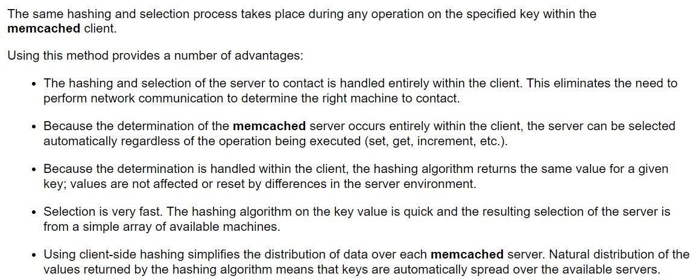
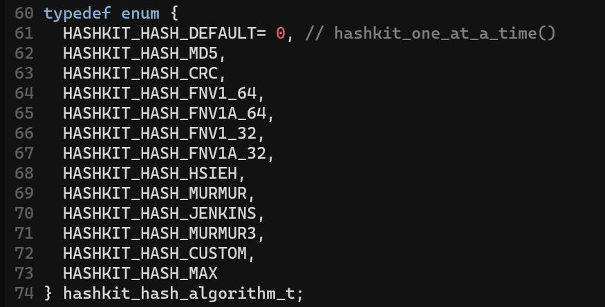

# Daily Report

##  ToDo List

1. Memcached의 server selection에 사용되는 hash function 조사
2. UVM의 성능 저하와 관련된 issue 및 solution 조사
3. Memcached에서 사용되는 hash function 조사 혹은 논문 작성을 위해 사용할 새로운 hash function 관련 조사
4. NIC\-GPU 간의 Direct communication으로 얻을 수 있는 성능적 이점 파악
5. Memcached의 노드당 메모리 크기 조사
6. Memcached의 real trace or synthetic data 조사
7. Memcached / Redis / MICA 파악
8. ixgbe & ixgbevf 코드 파악

---
## 01/04 현재 상황

* ToDo List에 있는 사항들을 조사중에 있다.
* 간략한 요약을 먼저 남기자면 다음과 같다.

1. Memcached의 server selection에 사용되는 hash function 조사
* 보통 bit operation 수준의 간단한 hashing 과정을 거친다.
2. UVM의 성능 저하와 관련된 issue 및 solution 조사
* 아직 조사중에 있다.
3. Memcached에서 사용되는 hash function 조사 혹은 논문 작성을 위해 사용할 새로운 hash function 관련 조사
* MD5, Jenkins 등의 유명하고 많이 사용하는 hash function들을 주로 사용한다.
4. NIC\-GPU 간의 Direct communication으로 얻을 수 있는 성능적 이점 파악
* Network가 큰 overhead인 것 같긴 하지만 더 많은 논문을 조사할 필요가 있다. 
5. Memcached의 노드당 메모리 크기 조사
* AWS기준으로 3GB에서 14GB정도를 제공한다.
6. Memcached의 real trace or synthetic data 조사
* [Twitter Real Trace](https://github.com/twitter/cache-trace)
* [mutilate Memcached load generator](https://github.com/leverich/mutilate)
* 첫번째는 Twitter에서 제공하는 Real Trace이고 두번째는 Synthetic Data generator이다.
7. Memcached / Redis / MICA 파악
* Memcached는 Multi\-Thread를 제공하는 Distributed Memory Caching System이며 In\-Memory KVS를 제공한다.
* Redis는 Memcached와 동일한 system이지만 Single Thread만을 제공하며 Memcached에 비해 더 많은 util성을 제공하며 Disk도 사용한다.
* 2015년도 이후로 MICA를 언급하는 곳은 찾기 힘들었다. 하지만 MICA 논문도 읽어봐야하고 조금 더 조사가 필요하다.

---
### 세부사항

1. Memcached의 server selection에 사용되는 hash function 조사

* 위의 코드는 Memcached C++ library의 코드 중 일부를 발췌한 것이다.
* 위의 함수는 client가 요청한 request를 어떠한 서버로 전송해야하는지 hashing하는데 사용되는 함수이다.
* 여기서 client는 **user**를 의미한다.
* user가 request를 보낼때 **직접 hashing을 진행해 server를 골라** 전송하는 것이다.
* hash function으로는 특별한 hash function을 사용하는 것이 아닌 bit operation을 통한 간단한 hashing을 진행하는 것을 확인할 수 있다.

* 위는 Oracle에서 설명한 Memcached에서 client가 server를 선택할때 진행되는 hashing 과정의 특징이다.
* client에서 server selection을 진행하며 이 때문에 client가 요청하는 operation과 무관하게 server가 선택된다고 한다.
* selection에 사용되는 hash function은 매우 빠른 algorithm이 사용된다고 한다.
    * 이 설명 위에 기재된 예시는 \(요청한 data의 값\) % \(총 server의 수\)일 정도로 단순했다.
* **결론 : server selection에 사용되는 hash function은 단순한 bit operation 수준에 해당하는 function.**

* 참고 : [Oracle Memcached Server Selection](https://docs.oracle.com/cd/E17952_01/mysql-5.6-en/ha-memcached-using-hashtypes.html)

2. UVM의 성능 관련 issue 및 solution 조사

* 이 부분은 아직 조사중에 있다.

3. Memcached에서 사용되는 hash function 조사 혹은 논문 작성을 위해 사용할 새로운 hash function 관련 조사

* 먼저 현재 Memcached에서 사용되는 hash function에는 어떤 종류가 있는지 살펴보았다.
* 역시 Memcached C++ library의 코드 중 일부를 참고했다.

* 위는 Memcached가 제공하는 hash algorithm들이다.
* 처음 들어보는 hash algorithm도 있지만 대부분 흔하게 사용되는 hash function들이다.
* Mega\-KV에서 hash function으로 사용했다고 생각한 AES의 경우 제공하지 않았다.
* AES는 client와 server간의 인증을 위해 사용한듯하다.
    * ~~사실 생각해보면 당연한 얘기이긴 하다....~~
    * Meag\-KV에서도 Signature ID를 생성할 때 사용했던 것 같다.
    * 추가확인 필요
* 위의 algorithm들이 사용된 이유를 파악할 이유가 있어보인다.
* 그 이유는 MD5 또안 보안에서 주로 사용되던 algorithm인데 hashing으로 사용되었다는 것은 value를 통해 생성된 key를 이용해 다시 value를 알아내지 못하도록 하는 보안관련 issue가 있을 수 있기 때문이다.
* 그 외에도 성능적으로 어느정도의 overhead까지 용인되는지 등등의 issue가 있다.
* **중간 결론 : Memcached에는 평범하게 유명한 hash algorithm들이 사용됨. 각 algorithm들이 사용된 이유 파악 필요**
* 중간 결론인 이유는 새로운 hash function을 만드는 방법에 대해서는 알아보지 않았기 때문이다.
* 위의 중간 결론을 교수님이랑 같이 얘기해본 뒤 새로운 hash function을 만드는 방식으로 novelty를 채우는 것이 맞는지 확인해볼 필요가 있다.

4. NIC\-GPU 간의 Direct Communication으로 얻을 수 있는 성능적 이점 파악

* 이는 논문을 더 찾아볼 필요가 있을 것 같다.
* 2013년도 이전의 논문들이라 오래된 논문들이긴 하지만 대부분 Network에 Bottleneck이 있다고 서술하고 있는 논문들을 발견했다.
* 더 자세히 읽어보고 다른 GPU에 KVS를 offload시킨 논문들을 파악할 필요가 있을 것 같다.
    * 특히 Motive가 된 Designing High\-Performance In\-Memory Key\-Value Operations with Persistent GPU Kernels and OpenSHMEM 논문을 읽어볼 필요가 있다.

5. Memcached의 노드당 메모리 크기 조사

* 위는 AWS에서 제공하는 Memcached 노드의 정보가 기록된 표이다.
* 각 노드당 제공되는 메모리의 크기가 다양하다.
* 3.22GB부터 14.28GB까지 다양하며 총 Memory의 크기는 평균적으로 35GB에서 42GB사이로 제공되는 것 같다.
* **결론 : 각 노드당 제공되는 메모리의 크기는 3GB부터 14GB까지 존재한다.**

* 참고 : [AWS Nodes Select Size](https://docs.aws.amazon.com/AmazonElastiCache/latest/mem-ug/nodes-select-size.html)

6. Memcached의 real trace or synthetic data 조사

* 2개의 Open Source\(?\)를 발견했다.
* [Twitter Real Trace](https://github.com/twitter/cache-trace)
* [mutilate Memcached load generator](https://github.com/leverich/mutilate)
* Twitter Real Trace는 말 그대로 Twitter Request를 모은 Real Trace이다.
* 압축된 크기는 2.8TB이고 압축이 풀린 크기는 14TB이다.
* 이는 A large scale analysis of hundreds of in-memory cache clusters at Twitter라는 2020년도 OSDI에 실린 논문 저자들이 분석 후 정리한 trace이다.
* mutilate은 Characterizing Facebook's Memcached Workload라는 IEEE Internet Computing에 publish된 논문에서 소개된 Memcached Load generator이다.
* 위의 두가지 모두 사용이 가능할 것 같으며 특히 **Twitter Real Trace의 경우 2020년 OSDI에 실린 논문 저자들이 정리한 trace이므로 신뢰도가 아주 높아보인다.**
* 위의 두가지가 각각 Real Trace와 Synthetic Data이다.

 
7. Memcached / Redis / MICA 파악

    ###### Memcached
* In\-Memory KVS system
* RAM안에 모든 Data를 저장한 뒤 client가 data를 요청할 경우 KVS를 사용해 data를 찾아주는 시스템이다.
* Memory\(RAM\)을 Cache처럼 사용하기 때문에 Memcached라고 불리며 RAM에 모든 데이터를 저장하기 때문에 서버가 종료되면 모든 데이터가 사라진다.
* 이 때문에 DB\(Disk\)에도 데이터를 저장하며 데이터를 저장하는 기간동안에는 DB에서 데이터를 검색해와야해 성능이 떨어질 수 있다.
* Memory Caching기능 뿐만아니라 Distributed Memory System도 제공한다.
* 여러개의 Server의 Memory를 하나의 Server의 Memory처럼 사용할 수 있도록 해준다.
* 위의 기능들을 포함한 가장 단순한 기능들만 탑재하여 속도가 빠르다.
* Multi\-Thread를 지원한다.

    ###### Redis
* In\-Memory KVS System
* Memcached와 동일하게 대부분의 데이터를 Memory에 저장하지만 Disk에도 데이터를 저장한다.
* Disk와 Memory 간의 데이터 Synchronization을 위해 2가지 기법을 제공한다.
    * Snapshotting과 AOF가 있다.
    * Snapshotting은 특정 시점의 Snapshot을 Disk에 지속적으로 저장해 Server Reboot시 해당 Snapshot만을 load하는 방식이다.
    * AOF\(Append On File\)방식은 redis의 모든 write/update 연산 자체를 모두 log파일에 기록하는 형태이다.
    * 자세한 내용은 아래의 링크를 참조할 것
    * [About Redis](https://brownbears.tistory.com/43)
* String만 지원하는 Memcached와 달리 set, sorted set, list 등 다양한 자료구조를 제공한다.
* Multi\-Thread를 지원하지 않아 Single Thread만을 사용한다.
* 아래의 링크가 Memcached와 Redis의 비교 분석을 간단하게 잘 요약해두었다.
* [Memcached vs Redis](https://chrisjune-13837.medium.com/redis-vs-memcached-10e796ddd717) 

    ###### MICA
* MICA는 2014년 NSDI에 실린 논문이다.
* Memcached를 확장 및 변형시킨 In\-Memory KVS이다.
    * 논문명도 MICA: A Holistic Approach to Fast In\-Memory Key\-Value Storage이고 논문 내부에서도 Storage라는 표현을 사용하지만 In\-Memory라는 표현으로 미루어보았을때 Disk는 사용하지 않을 것 같다.
* [MICA github](https://github.com/efficient/mica)
* 이 당시에는 Redis가 강한 영향력을 가지지 못한 시기였던 것 같다.
    * Redis는 2009년에 개발되었지만 2015년부터 Redis Labs가 지원하기 시작했다.
* Evaluation에서 Memcached, MemC3, RAMCloud 등과는 비교했지만 Redis는 비교군에 넣지 않았다.
* 현재 가장 많이 사용되고 있다는 Redis가 크게 상용화되기 전의 논문이어서 그런지는 논문들을 추가적으로 확인해볼 필요가 있긴하다.
    * Mega\-KV에서는 MICA를 이용해 비교하긴 했지만 Mega\-KV도 2015년도 논문이기 때문에 실험 당시에는 Redis가 지원받기 전이었다.
* MICA가 어느정도의 영향력을 가지고 있고 MICA와 비교하는 것이 타당한 evaluation 방향인지는 조금더 찾아볼 필요가 있다.

* 참고 사이트
[Redis & Memcached 정리](https://real-dongsoo7.tistory.com/114)
[Memcached and Persistence](https://www.gosquared.com/blog/memcache-and-persistence)
[Redis vs. Memcached: In-Memory Data Storage Systems](https://alibaba-cloud.medium.com/redis-vs-memcached-in-memory-data-storage-systems-3395279b0941)
[\[Cache\] Redis vs. Memcached](https://chrisjune-13837.medium.com/redis-vs-memcached-10e796ddd717)
[AWS Memcached](https://aws.amazon.com/ko/memcached/)
[Opendocs](https://myblog.opendocs.co.kr/archives/591)
[About Redis](https://brownbears.tistory.com/43)
[MICA github](https://github.com/efficient/mica)
